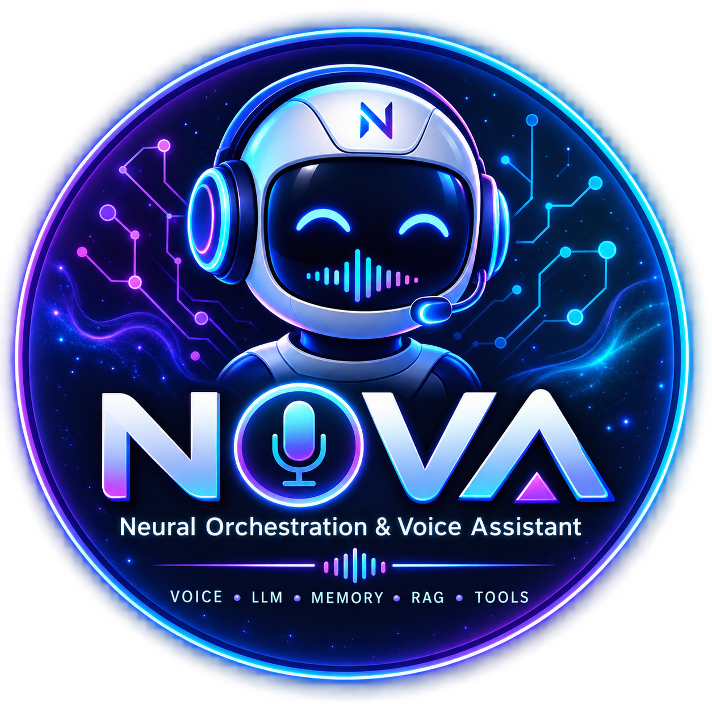

<div align="center">



# NOVA

## Neural Orchestration & Voice Assistant

**A local-first, modular AI voice agent powered by speech, memory, tools and local LLMs.**

<br/>


<br/><br/>

[**🚀 Quick Start**](#-quick-start) ·
[**🏗️ Architecture**](#️-system-architecture) ·
[**🧠 Core Features**](#-key-features) ·
[**⚠️ Limitations**](#-known-limitations)

</div>

---

## ⚠️ Project Status

> **NOVA is currently in the Testing & Development Phase.**
>
> The core architecture and major modules are functional, but this is still an
> actively evolving prototype. Voice recognition and speech segmentation can
> occasionally produce inaccurate transcriptions, while the text-to-speech
> pipeline may require further refinement depending on the local environment.
>
> Future development is focused on improving sentence-level audio capture,
> speech recognition reliability, TTS stability, and overall runtime
> robustness.

---

## ✨ What is NOVA?

NOVA is a modular AI voice assistant that combines **speech recognition,
voice activity detection, intelligent content classification, local LLM
inference, RAG-based memory, tool calling, and text-to-speech** into a single
local-first system.

The goal is not just to build a chatbot, but to explore how multiple AI
components can work together as an **orchestrated agent pipeline**.

---

## 🧰 Tech Stack

- **Python** — application and orchestration layer
- **faster-whisper** — speech-to-text
- **Silero VAD** — voice activity detection
- **Qwen3 / Phi-4 Mini** — local LLM inference through `llama-cpp-python`
- **MobileBERT** — actionable/contextable content classification
- **FAISS + Sentence Transformers** — RAG-based memory retrieval
- **SymPy** — calculator/tool computation
- **Weatherstack** — optional real-time weather data
- **Google Calendar API** — optional calendar integration
- **Rich** — terminal interface
- **pyttsx3** — text-to-speech

## 🧠 Core Capabilities

| Capability | What NOVA does |
|---|---|
| 🎙️ **Voice Input** | Captures speech through the microphone and processes it with VAD + Whisper |
| 🧩 **AI Gating** | Uses fine-tuned MobileBERT classifiers to decide what should be acted on or remembered |
| 🧠 **Local Intelligence** | Runs Qwen3 / Phi-4 Mini locally through `llama-cpp-python` |
| 🗂️ **RAG Memory** | Retrieves relevant stored context using embeddings + FAISS |
| 🛠️ **Tool Calling** | Connects natural-language requests to calculator, weather and calendar tools |
| 🔊 **Voice Output** | Converts generated responses back into speech |
| ⚙️ **Modular Design** | Individual components can be replaced or extended independently |

---

## 🌟 Key Features

### Core AI Pipeline
- **Advanced Speech-to-Text**: Real-time transcription using faster-whisper with optimized models
- **Voice Activity Detection**: Silero VAD for precise speech detection with configurable thresholds
- **Intelligent Classification**: Fine-tuned MobileBERT models for actionable and contextable content filtering
- **Local LLM Inference**: Qwen3-1.7B and Phi4-Mini models via llama-cpp-python (no API required)
- **Sentence Segmentation**: spaCy-powered intelligent sentence boundary detection
- **Contextual Memory**: RAG-based memory system with conversation history tracking

### Tool Integration
- **Calculator**: Advanced mathematical computations with symbolic math support
- **Weather Checker**: Real-time weather data via Weatherstack API
- **Google Calendar**: Full calendar management (create, read, update, delete events)
- **Extensible Framework**: Easy-to-add custom tools with structured JSON calling

### User Experience
- **Rich Console Interface**: Beautiful terminal UI with real-time status updates
- **Text-to-Speech**: Optional voice responses with configurable settings
- **Configuration Management**: YAML-based configuration with multiple model profiles
- **Comprehensive Logging**: Detailed logs for conversation history and system diagnostics

## 🏗️ System Architecture

> **Microphone → VAD → STT → Classification → Memory/RAG → Local LLM → Tools → TTS → Speaker**


```
┌─────────────────────────────────────────────────────────────────┐
│                        VOICE ASSISTANT PIPELINE                │
├─────────────────────────────────────────────────────────────────┤
│ Audio Input → VAD → STT → Sentence Segmentation → Classification │
│      ↓              ↓         ↓                      ↓          │
│  Microphone    Voice Activity  Speech-to-Text    Content Filter │
│                Detection      (faster-whisper)   (MobileBERT)   │
│                (Silero)                                          │
├─────────────────────────────────────────────────────────────────┤
│ Classification → Context Management → LLM Processing → Response │
│      ↓                ↓                    ↓             ↓      │
│ Actionable/         Memory Store        Local LLM      Tool     │
│ Contextable         (RAG)              (Qwen3/Phi4)   Execution │
│ (MobileBERT)                                                    │
├─────────────────────────────────────────────────────────────────┤
│ Tool Execution → Response Generation → TTS → Audio Output       │
│      ↓                ↓                ↓         ↓              │
│ Calculator/         Natural Language   Text-to-  Speaker        │
│ Weather/Calendar    Response           Speech                   │
│                                                                 │
└─────────────────────────────────────────────────────────────────┘
```

## 🎯 Why NOVA?

NOVA was designed as an experiment in building a **modular, local-first AI
agent** rather than relying entirely on a hosted chatbot API.

The architecture separates speech, classification, memory, reasoning and
tool execution so each layer can be tested, improved or replaced independently.

## 📁 Project Structure

```
NOVA-AI-Voice-Assistant/
├── configs/                          # Configuration files
│   ├── config.yaml                   # Main configuration (Qwen3)
│   └── config_phi4mini.yaml          # Alternative configuration (Phi4-Mini)
├── src/                              # Core source code
│   ├── stt/                          # Speech-to-Text module
│   │   ├── __init__.py
│   │   └── stt.py         # faster-whisper implementation
│   ├── vad/                          # Voice Activity Detection
│   │   ├── __init__.py
│   │   └── vad.py                    # Silero VAD implementation
│   ├── tts/                          # Text-to-Speech module
│   │   ├── __init__.py
│   │   └── text_to_speech.py                    # pyttsx3 implementation
│   ├── gating_classifiers/           # Content classification
│   │   ├── __init__.py
│   │   ├── actionable_classifier.py  # Action detection
│   │   ├── contextable_classifier.py # Context worthiness
│   │   └── sentence_segmenter.py     # Sentence boundary detection
│   ├── llm/                          # Local LLM inference
│   │   ├── __init__.py
│   │   ├── qwen_llm.py              # Qwen3-1.7B implementation
│   │   └── phi4_mini_llm.py         # Phi4-Mini implementation
│   ├── rag/                          # Retrieval-Augmented Generation
│   │   ├── __init__.py
│   │   └── memory_store.py           # Vector database for context
│   └── tool_calls/                   # Tool execution framework
│       ├── __init__.py
│       ├── tool_manager.py           # Tool orchestration
│       ├── calculator.py             # Mathematical calculations
│       ├── weather.py                # Weather information
│       └── google_calendar.py        # Calendar management
├── models/                           # Local AI models (large weights excluded from Git)
│   ├── Qwen3-1.7B-Q4_0.gguf        # Primary local LLM (~1GB, not committed)
│   ├── mobilebert-finetuned-actionable/   # Actionable classifier
│   └── mobilebert-finetuned-contextable/  # Contextable classifier
├── memory/                           # Runtime memory and logs (generated locally)
│   └── (created automatically at runtime)
├── tests/                           # Unit tests
├── main.py                          # Main entry point
├── setup_google_calendar.py         # Google Calendar setup utility
├── requirements.txt                 # Python dependencies
├── .env.example                    # Environment variable template
│   └── .env                          # Local secrets (create manually; not committed)
├── .gitignore                      # Git ignore rules
└── README.md                       # This documentation
```

## 🚀 Quick Start

### Prerequisites
- Python 3.8+ (recommended: 3.10+)
- 4GB+ RAM (for local LLM inference)
- Microphone and speakers/headphones
- Internet connection (for weather and calendar features)

### 1. Clone and Setup

```bash
git clone https://github.com/monugupta7033/NOVA-AI-Voice-Assistant.git
cd NOVA-AI-Voice-Assistant

# Create virtual environment
python -m venv venv

# Activate virtual environment
# Windows:
venv\Scripts\activate
# Linux/macOS:
source venv/bin/activate

# Install dependencies
pip install -r requirements.txt

# Install spaCy English model
python -m spacy download en_core_web_sm
```

### 2. Download AI Models

**LLM Model (Required for local LLM inference):**
Download Qwen3-1.7B model from the unsloth repository:
```bash
# Create models directory
mkdir models

# Download the Q4_0 quantized model (~1 GB) - recommended for local inference
wget https://huggingface.co/unsloth/Qwen3-1.7B-GGUF/resolve/main/Qwen3-1.7B-Q4_0.gguf -O models/Qwen3-1.7B-Q4_0.gguf

# Alternative: For lower memory usage, download the Q2_K model (778 MB)
# wget https://huggingface.co/unsloth/Qwen3-1.7B-GGUF/resolve/main/Qwen3-1.7B-Q2_K.gguf -O models/Qwen3-1.7B-Q2_K.gguf

# Or browse all available quantizations at:
# https://huggingface.co/unsloth/Qwen3-1.7B-GGUF/tree/main
```

**Classification Models (Required):**
Download the fine-tuned MobileBERT models using the following commands:
```bash
# Create models directory if not already created
mkdir -p models

# Download/place the fine-tuned MobileBERT model files in:
# models/mobilebert-finetuned-actionable/
# models/mobilebert-finetuned-contextable/
#
# The large model weight files are intentionally NOT committed to this GitHub
# repository. See the model documentation/releases for the required weights.
```

The models will be placed in:
- `models/mobilebert-finetuned-actionable/`
- `models/mobilebert-finetuned-contextable/`

### 3. Environment Configuration

Create `.env` file for API keys:
```bash
# Weatherstack API (get free key at https://weatherstack.com/signup)
WEATHERSTACK_API_KEY=your_weatherstack_api_key_here

# Google Calendar API (optional, see setup instructions below)
GOOGLE_CALENDAR_CREDENTIALS=path/to/credentials.json
```

### 4. Run the Assistant

```bash
# Use default configuration (Qwen3)
python main.py

# Or specify custom configuration
python main.py --config configs/config_phi4mini.yaml
```

## ⚙️ Configuration

### Main Configuration (config.yaml)

```yaml
# Audio settings
audio:
  sample_rate: 16000        # Audio sample rate (Hz)
  block_duration: 0.5       # Processing block size (seconds)
  channels: 1               # Mono audio

# Speech-to-Text settings
stt:
  model_size: "small"       # Whisper model size (tiny/base/small/medium/large)
  compute_type: "int8"      # Computation precision (float32/float16/int8)
  device: "cpu"             # Device (cpu/cuda)

# Voice Activity Detection
vad:
  threshold: 0.5            # Voice detection threshold (0.0-1.0)
  min_speech_duration_ms: 150
  speech_pad_ms: 400

# Text-to-Speech settings
tts:
  enabled: true             # Enable/disable voice responses
  rate: 200                 # Speech rate (WPM)
  volume: 0.9               # Volume level (0.0-1.0)
  voice: null               # System voice ID (null for default)

# LLM settings
llm:
  model_type: "qwen3"       # Model type (qwen3/phi4mini)
  model_path: "models/Qwen3-1.7B-Q4_0.gguf"
  n_ctx: 8192               # Context window size
  n_threads: 8              # CPU threads
  max_tokens: 2000          # Max response tokens
  temperature: 0.8          # Sampling temperature
  top_p: 0.9                # Top-p sampling

# Gating Classifiers
gating_classifiers:
  actionable_model_path: "./models/mobilebert-finetuned-actionable"
  actionable_threshold: 0.5
  contextable_model_path: "./models/mobilebert-finetuned-contextable"
  contextable_threshold: 0.6

# Memory settings
conversation_memory:
  max_turns: 5              # Max conversation history
  include_in_prompt: true

# API settings
weatherstack:
  api_key: null             # Use .env file instead
  default_units: "m"        # Temperature units (m/f/s)
```

## 🔧 Advanced Setup

### Google Calendar Integration

1. **Install additional dependencies:**
   ```bash
   pip install google-auth google-auth-oauthlib google-auth-httplib2 google-api-python-client pytz
   ```

2. **Set up Google Calendar API:**
   ```bash
   python setup_google_calendar.py
   ```

3. **Follow the authentication flow** to generate `token.json`

### Model Switching

To switch between LLM models:

```yaml
# For Phi4-Mini (smaller, faster)
llm:
  model_type: "phi4mini"
  model_path: "models/Phi-4-mini-instruct-Q4_K_M.gguf"
  n_ctx: 2048

# For Qwen3 (larger, more capable)
llm:
  model_type: "qwen3"
  model_path: "models/Qwen3-1.7B-Q4_0.gguf"
  n_ctx: 8192
```

### Custom Tool Development

Create new tools by extending the tool framework:

```python
# src/tool_calls/my_custom_tool.py
class MyCustomTool:
    @staticmethod
    def get_tool_info():
        return {
            "name": "my_custom_tool",
            "description": "Description of what the tool does",
            "parameters": {
                "type": "object",
                "properties": {
                    "param1": {
                        "type": "string",
                        "description": "Parameter description"
                    }
                },
                "required": ["param1"]
            }
        }
    
    @staticmethod
    def execute(param1: str):
        # Tool implementation
        return {"result": f"Processed: {param1}"}
```

Register in `ToolManager`:
```python
self.tools["my_custom_tool"] = MyCustomTool
```

## 💬 Usage Examples

### Voice Commands

**Mathematical Calculations:**
- "What's 15 plus 27?"
- "Calculate the sine of 59 degrees"
- "What's the square root of 144?"

**Weather Queries:**
- "What's the weather like?"
- "Temperature in London"
- "Is it raining in Tokyo?"

**Calendar Management:**
- "Schedule a meeting tomorrow at 2 PM"
- "What are my events today?"
- "Find free time tomorrow for 30 minutes"
- "Cancel my 3 PM meeting"

**General Conversation:**
- "How are you today?"
- "What can you help me with?"
- "Tell me about artificial intelligence"

### Tool Call Examples

The system automatically detects when to use tools based on user intent:

```
User: "What's 25 times 8?"
→ Uses calculator tool
→ Response: "🧮 **200**"

User: "Weather in Paris"
→ Uses weather tool
→ Response: "🌤️ It's 18°C and partly cloudy in Paris..."

User: "Book a dentist appointment next Tuesday at 10 AM"
→ Uses Google Calendar tool
→ Response: "📅 Event 'Dentist appointment' created for Tuesday at 10:00 AM"
```

## 🔍 System Components

### 1. Speech Processing Pipeline

**Voice Activity Detection (VAD):**
- Continuous audio monitoring
- Silero VAD model for precise speech detection
- Configurable sensitivity and padding

**Speech-to-Text (STT):**
- faster-whisper for real-time transcription
- Multiple model sizes available
- CPU and GPU support

**Sentence Segmentation:**
- spaCy-powered sentence boundary detection
- Clean, readable transcript formatting
- Rich console display with proper formatting

### 2. AI Classification System

**Actionable Classifier:**
- Determines if speech contains commands/requests
- Filters out statements and questions
- Only actionable content triggers task execution

**Contextable Classifier:**
- Evaluates content worthiness for memory storage
- Prevents context pollution from trivial statements
- Maintains relevant conversation history

### 3. Local LLM Inference

**Qwen3-1.7B Model:**
- 1008MB quantized model (Q4_0)
- 8192 token context window
- Optimized for conversation and tool calling

**Phi4-Mini Model:**
- Alternative smaller model option
- Faster inference, lower memory usage
- 2048 token context window

### 4. Tool Execution Framework

**Calculator Tool:**
- Advanced mathematical expressions
- Trigonometric functions with unit support
- Symbolic mathematics via SymPy

**Weather Tool:**
- Real-time weather data
- Multiple temperature units
- Location-based queries

**Google Calendar Tool:**
- Full CRUD operations on calendar events
- Natural language date/time parsing
- Free time finding and availability checking

### 5. Memory and Context Management

**Conversation Memory:**
- Maintains recent chat history
- Configurable turn limit
- Persistent logging to file

**RAG Memory Store:**
- Vector database for long-term knowledge
- FAISS-powered similarity search
- Automatic context retrieval

## 🧪 Known Limitations

- **Speech recognition:** Depending on microphone quality, background noise, and VAD segmentation, Whisper may occasionally mis-transcribe short or continuous speech.
- **Speech segmentation:** The current audio pipeline is still being refined for more reliable sentence-level capture.
- **Text-to-speech:** TTS behavior can vary with the Windows audio/runtime environment and may require further stability improvements.
- **Local inference:** Model loading and response latency depend on available RAM, CPU threads, and model size.
- **Large model files:** The Qwen GGUF and MobileBERT weight files are excluded from Git to keep the repository lightweight. They must be obtained separately for a fully local setup.

## 🛠️ Troubleshooting

### Common Issues

**Audio Device Problems:**
```bash
# List available audio devices
python -c "import sounddevice as sd; print(sd.query_devices())"
```

**Model Loading Errors:**
- Ensure models are in correct directories
- Check file permissions and sizes
- Verify model format compatibility

**Classification Model Issues:**
- Ensure tokenizer files are present
- Check model configuration files
- Verify model loading logs

**Google Calendar Setup:**
- Follow authentication flow completely
- Check credentials.json permissions
- Verify token.json generation

**Memory Allocation:**
- Reduce n_ctx for lower memory usage
- Use smaller model variants
- Adjust n_threads based on CPU cores

### Performance Optimization

**For Low-End Hardware:**
```yaml
# Use smaller models
stt:
  model_size: "tiny"
llm:
  model_type: "phi4mini"
  n_ctx: 1024
  n_threads: 4
```

**For High-End Hardware:**
```yaml
# Use larger, more accurate models
stt:
  model_size: "medium"
  device: "cuda"  # If GPU available
llm:
  n_ctx: 8192
  n_threads: 16
```

## 📊 System Monitoring

The assistant provides real-time monitoring:

- **Audio Status**: Microphone input levels and VAD state
- **Processing Times**: STT, classification, and LLM inference timing
- **Tool Execution**: Success/failure status and results
- **Memory Usage**: Conversation turns and context length
- **Classification Confidence**: Actionable and contextable scores

## 🔐 Security & Privacy

**Local Processing:**
- All AI inference runs locally (no API calls for core functionality)
- Conversation data stays on your machine
- Optional cloud APIs only for weather/calendar features

**Data Handling:**
- Conversation logs stored locally
- No telemetry or usage tracking
- API keys managed through environment variables

## 🧑‍💻 Development

### Testing

```bash
# Run all tests
python -m unittest discover -s tests

# Test specific components
python -m unittest tests.test_stt
python -m unittest tests.test_classification
```

### Contributing

1. Fork the repository
2. Create a feature branch
3. Implement changes with tests
4. Submit a pull request

### Architecture Extensions

The modular design allows easy extension:

- **New STT Backends**: Implement alternative speech recognition
- **Additional Classifiers**: Add domain-specific content filtering
- **Custom LLMs**: Integrate different language models
- **Extended Tools**: Create specialized task executors
- **Alternative TTS**: Implement different voice synthesis options

## 📄 License

No license file has been added to the repository yet. If you plan to distribute NOVA publicly, add an appropriate license before treating the project as open-source.

## 🙏 Acknowledgements

- **[faster-whisper](https://github.com/guillaumekln/faster-whisper)**: High-performance speech recognition
- **[Silero VAD](https://github.com/snakers4/silero-vad)**: Voice activity detection
- **[llama-cpp-python](https://github.com/abetlen/llama-cpp-python)**: Local LLM inference
- **[Hugging Face Transformers](https://huggingface.co/transformers/)**: Classification models
- **[spaCy](https://spacy.io/)**: Natural language processing
- **[Rich](https://github.com/Textualize/rich)**: Terminal user interface
- **Qwen Team**: Qwen3 language model
- **Microsoft**: Phi-4 Mini language model

## 📞 Support

For issues, feature requests, or questions:

1. Check the troubleshooting section above
2. Search existing GitHub issues
3. Create a new issue with detailed information
4. Include configuration files and error logs when relevant

---

---

<div align="center">

### 🎙️ NOVA

**Neural Orchestration & Voice Assistant**

*Built as an evolving AI engineering project — from speech input to local reasoning and intelligent actions.*

<br/>

**⭐ If you find the project interesting, consider starring the repository.**

</div>
 